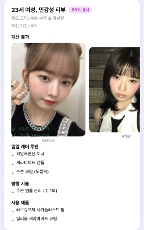

# AI Skin Diary

> 반복 촬영한 피부 사진과 선택 입력한 처방전/소견서를 Upstage Document Parse와 Solar LLM 기반 워크플로우로 분석해, 사용자의 피부 변화 추이와 맞춤 케어 리포트를 제공하는 iOS 데모입니다.

이 저장소는 심사용 데모를 목적으로 하며, `docs/presentation/ysai_f4_presentation.pdf`와 `workflows/ysai_f4_skin_workflow_v2.json`에 정리된 서비스 흐름을 SwiftUI 앱 화면으로 구현한 결과물입니다.

---

## 1. 프로젝트 개요 & 문제 정의

### 해결하려는 문제

- **타겟 사용자**: 피부 트러블, 붉은기, 수분 부족, 피부결 변화 등을 꾸준히 관리하고 싶은 사용자
- **상황**: 매일 또는 주기적으로 피부 상태를 확인하지만, 사진과 제품 사용 기록이 흩어져 있어 실제 개선 여부를 판단하기 어려움
- **어려움**: 단일 사진만으로는 변화 추이를 알기 어렵고, 온라인 후기나 제품 추천은 광고성 콘텐츠가 많아 신뢰하기 어려움

### 제안하는 솔루션

AI Skin Diary는 사용자가 같은 조건에서 촬영한 피부 사진을 일기처럼 누적하고, 붉은기, 트러블, 피부결, 수분도 같은 지표를 시계열로 비교합니다. 선택적으로 처방전/소견서를 업로드하면 Upstage Document Parse로 의료 맥락을 구조화하고, Solar LLM이 사용자의 피부 변화와 신뢰도 필터를 통과한 레퍼런스를 바탕으로 오늘의 케어 액션, 추천/회피 성분, 유사 사례, 병원 상담 시그널을 생성합니다.

### 기대 효과

- 피부 상태를 감각이 아니라 데이터 기반으로 추적
- 제품과 루틴의 실제 개선 효과를 시계열로 확인
- 광고성 후기보다 사용자 상태와 관련 있는 신뢰 가능한 레퍼런스 중심 추천
- 병원 방문 전 피부 변화 기록과 요약 리포트 준비

---

## 2. 사용한 Upstage API & 사용 방식

| API | 사용 위치 | 사용 목적 |
| --- | --- | --- |
| Upstage Document Parse | `workflows/ysai_f4_skin_workflow_v2.json`의 `Upstage Document Parse` 노드 | 처방전/소견서에서 약품, 진단명, 시술 정보를 추출 |
| Upstage Solar LLM | `workflows/ysai_f4_skin_workflow_v2.json`의 `Upstage Solar LLM` 노드 | 시계열 피부 지표, 의료 정보, 신뢰도 필터링 레퍼런스를 종합해 개인 맞춤 솔루션 JSON 생성 |
| Upstage API-compatible Chat Completions | `Solar 입력 빌드` 노드 | `response_format: json_object` 기반으로 앱/이메일에서 재사용 가능한 구조화 결과 생성 |

### 핵심 워크플로우

발표자료의 전체 서비스 컨셉은 다음 흐름입니다.

1. 사용자가 피부 사진과 선택적으로 처방전/소견서 파일을 업로드합니다.
2. 피부 사진 분석 API가 주요 피부 지표를 추출합니다.
3. 최근 기록과 기준값을 비교해 7일 이동평균, 변화율, 악화 지표를 계산합니다.
4. 처방전이 있는 경우 Upstage Document Parse로 약품, 진단명, 시술 정보를 구조화합니다.
5. 사용자의 피부 지표와 의료 맥락을 바탕으로 후기/뉴스 레퍼런스를 검색하고 광고성 콘텐츠를 필터링합니다.
6. Upstage Solar LLM이 오늘의 액션, 추천/회피 성분, 유사 사례, 병원 상담 시그널을 생성합니다.
7. 결과를 앱 화면과 이메일 리포트 형태로 제공합니다.

현재 SwiftUI 앱은 위 흐름 중 사용자가 심사 과정에서 직접 확인할 수 있는 모바일 UX를 중심으로 구현되어 있습니다.

### 구현 디테일

- n8n 워크플로우는 피부 사진 분석, 시계열 변화율 계산, 처방전 파싱, RSS 검색, Trust Filter, Solar 리포트 생성, HTML 이메일 발송으로 구성했습니다.
- Trust Filter는 `협찬`, `체험단`, `광고`, `쿠폰`, `이벤트` 등 광고성 키워드와 `내돈내산`, `직접 구매`, `단점`, `실패` 등 신뢰 신호를 함께 사용해 1차 필터링합니다.
- Solar 응답은 `summary`, `trend`, `today_actions`, `recommended_ingredients`, `avoid_ingredients`, `case_matches`, `see_doctor_signal`, `disclaimer`를 포함하는 JSON으로 제한했습니다.
- SwiftUI 앱은 실제 API 연동 전 심사용 UX 검증을 위해 `MockData` 기반으로 동작합니다.

---

## 3. 데모 / 결과



### 앱 화면 구성

하단 탭 기준으로 다음 화면을 확인할 수 있습니다.

- `피부 일기`: 날짜별 피부 사진, 타임랩스, 지표별 변화
- `분석`: Swift Charts 기반 변화 추이와 AI 인사이트
- `리포트`: 전문가 진료용 요약 리포트와 JSON 내보내기
- `케어`: 유사 사례, 추천 화장품, 추천 시술

### 핵심 기능

#### 피부 일기와 타임랩스

- 날짜별 피부 사진을 타임라인 형태로 확인
- 선택한 날짜의 붉은기, 트러블, 피부결, 수분도 표시
- 여러 날짜 사진을 순차 재생하는 타임랩스 모드
- 같은 조도와 같은 시간대 촬영을 유도하는 업로드 가이드

#### AI 분석 대시보드

- 붉은기, 트러블, 피부결, 수분도 요약 카드
- Swift Charts 기반 변화 추이 차트
- 개선/악화 방향을 지표별로 다르게 해석
- 사용자에게 바로 이해되는 한국어 AI 인사이트 제공

#### 전문가 진료 리포트

- 병원 방문 시 참고할 수 있는 피부 변화 요약
- 분석 기간, 기록 일수, 촬영 조건, 주요 변화 수치 표시
- 날짜별 사진 기록과 전문가 참고사항 제공
- JSON 내보내기 데모 구현
- PDF 내보내기는 데모 알림 형태로 표시

#### 유사 사례 기반 케어 추천

- 비슷한 피부 고민을 가진 사례와 유사도 표시
- Before/After 이미지 기반 개선 결과 확인
- 루틴, 병행 시술, 사용 제품 추천
- 화장품과 시술 추천을 별도 섹션으로 구분

#### 사진 업로드 및 분석 진입점

- iOS PhotosPicker 기반 이미지 업로드
- 플로팅 카메라 버튼으로 빠른 기록 시작
- 현재 데모에서는 실제 모델 호출 대신 모의 분석값을 사용
- 실제 서비스에서는 `CameraCaptureView.runAnalysis()`가 피부 분석 API 호출부로 교체됩니다.

---

## 4. 실행 방법

### 사전 요구사항

- macOS
- Xcode 15 이상 권장
- iOS 16 이상 Simulator 또는 실제 iPhone

### 실행

1. Xcode에서 `SkinDiary.xcodeproj`를 엽니다.
2. 실행 타깃을 iOS Simulator 또는 실제 iPhone으로 선택합니다.
3. `SkinDiary` scheme을 실행합니다.
4. 하단 탭에서 `피부 일기`, `분석`, `리포트`, `케어` 화면을 확인합니다.

사진 업로드 데모를 실제 기기에서 확인하려면 사진 보관함 접근 권한이 필요합니다.

### n8n 워크플로우 참고

`workflows/ysai_f4_skin_workflow_v2.json`은 전체 AI 파이프라인 설계 파일입니다. 실제 실행을 위해서는 다음 환경값과 credential 설정이 필요합니다.

- `SKIN_ANALYZER_URL`: 피부 사진 분석 API 엔드포인트
- Upstage API Key: Document Parse 및 Solar LLM 호출
- Gmail SMTP credential: HTML 리포트 이메일 발송

---

## 5. 팀원

| 팀 | 역할 |
| --- | --- |
| YSAI F4 | 기획, AI 워크플로우 설계, SwiftUI 데모 구현 |

---

## 6. 기술 구성

| 영역 | 사용 기술 |
| --- | --- |
| iOS 앱 | SwiftUI, PhotosUI |
| 차트 | Swift Charts |
| 디자인 시스템 | SF Symbols, SwiftUI Gradient, 공용 Card Style |
| 데모 데이터 | `MockData` 기반 시계열 피부 기록 |
| 자동화 워크플로우 | n8n (`workflows/ysai_f4_skin_workflow_v2.json`) |
| 문서 파싱 설계 | Upstage Document Parse |
| LLM 솔루션 생성 설계 | Upstage Solar |
| 결과 전달 설계 | HTML 이메일 / Gmail SMTP |

## 7. 저장소 구조

```text
skinDiary/
├── README.md
├── PR_SUBMISSION.md
├── SkinDiary.xcodeproj/
├── SkinDiary/
│   ├── SkinDiaryApp.swift
│   ├── ContentView.swift
│   ├── Models/
│   │   └── SkinModels.swift
│   ├── Views/
│   │   ├── DiaryTimelineView.swift
│   │   ├── AnalysisDashboardView.swift
│   │   ├── ExpertReportView.swift
│   │   ├── CaseStudiesView.swift
│   │   └── CameraCaptureView.swift
│   └── Assets.xcassets/
├── docs/
│   ├── presentation/
│   │   └── ysai_f4_presentation.pdf
│   ├── sample-images/
│   │   ├── cy2.png
│   │   ├── st5.png
│   │   └── st6.png
│   └── screenshots/
│       └── app_screenshot.png
└── workflows/
    └── ysai_f4_skin_workflow_v2.json
```

## 8. 심사 시 확인 포인트

- 이 프로젝트는 완성된 상용 앱이 아니라, 발표자료의 서비스 아이디어를 검증하기 위한 iOS 데모입니다.
- 앱 내부 데이터는 심사용 샘플 이미지와 MockData를 사용합니다.
- 피부 사진 분석, 처방전 파싱, 신뢰도 필터, Solar 기반 리포트 생성은 `workflows/ysai_f4_skin_workflow_v2.json`에 n8n 워크플로우 형태로 설계되어 있습니다.
- SwiftUI 앱은 사용자가 실제로 보게 될 핵심 화면인 기록, 분석, 리포트, 추천 UX를 구현합니다.
- 의료 진단을 대체하는 서비스가 아니라, 사용자의 피부 변화 기록과 병원 상담 준비를 돕는 보조 도구로 설계했습니다.

## 9. 구현 상태와 다음 단계

현재 구현된 부분:

- SwiftUI 기반 4개 주요 탭 화면
- 샘플 피부 사진과 시계열 MockData
- 타임랩스 재생
- 차트 기반 분석 대시보드
- 전문가 리포트 미리보기와 JSON 내보내기
- 유사 사례, 제품, 시술 추천 UI
- n8n 기반 전체 AI 워크플로우 설계 파일

다음 단계:

- 실제 피부 분석 API 또는 CoreML/Vision 모델 연동
- 사용자별 기록 저장을 위한 SwiftData/CoreData 적용
- n8n 워크플로우와 iOS 앱 API 연결
- Upstage Document Parse 결과를 앱 리포트에 반영
- PDF 리포트 실제 생성 기능 구현
- 신뢰도 필터와 유사 사례 추천 로직 고도화

## 10. 참고 파일

- `docs/presentation/ysai_f4_presentation.pdf`: 프로젝트 발표자료
- `workflows/ysai_f4_skin_workflow_v2.json`: 피부 분석, 문서 파싱, 레퍼런스 필터링, Solar 리포트 생성, 이메일 발송까지의 n8n 워크플로우
- `docs/screenshots/app_screenshot.png`: 앱 화면 참고 이미지
- `docs/sample-images/`: 발표/문서용 샘플 이미지

## 11. 라이선스

별도 명시가 없는 한 PR 제출 대상 저장소의 MIT License 정책을 따릅니다.
